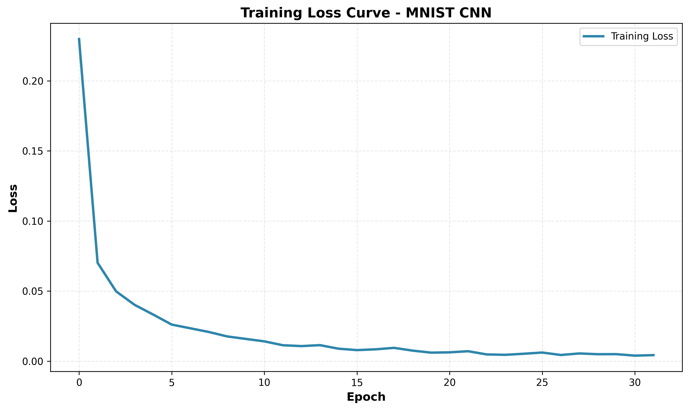

# MNIST CNN Classifier

<div align="center">


**A High-Performance Convolutional Neural Network for Handwritten Digit Recognition**

[Problema](#problema) • [Arquitetura](#arquitetura-da-rede) • [Resultados](#resultados-e-métricas) • [Instalação](#instalação) • [Uso](#uso)

</div>

---

## Problema

A classificação de dígitos manuscritos é um problema clássico em visão computacional e aprendizado de máquina. O desafio é reconhecer automaticamente dígitos (0-9) escritos à mão a partir de imagens em escala de cinza de 28×28 pixels.

### Dataset: MNIST

O dataset MNIST (Modified National Institute of Standards and Technology) é composto por:
- **60.000** imagens de treinamento
- **10.000** imagens de teste
- Imagens de 28×28 pixels em escala de cinza
- Labels com 10 classes (dígitos 0-9)

Este é um dos datasets mais populares em machine learning e serve como benchmark para algoritmos de classificação de imagens.

### Objetivo

Desenvolver um modelo de rede neural convolucional capaz de classificar dígitos manuscritos com alta acurácia, minimizando o erro de classificação e sendo eficiente em termos computacionais.

---

## Arquitetura da Rede

A arquitetura do modelo CNN foi projetada com dois componentes principais:

### 1. **Extrator de Características (Feature Extractor)**

O extrator utiliza convoluções e max pooling para aprender padrões espaciais hierárquicos:

```
┌─────────────────────────────────────────────┐
│ Input: (1, 28, 28)                          │
├─────────────────────────────────────────────┤
│ Conv2d(1→32, kernel=3×3, padding=1)        │
│ ReLU                                        │
│ MaxPool2d(2×2) → (32, 14, 14)               │
├─────────────────────────────────────────────┤
│ Conv2d(32→64, kernel=3×3, padding=1)       │
│ ReLU                                        │
│ MaxPool2d(2×2) → (64, 7, 7)                 │
└─────────────────────────────────────────────┘
```

**Detalhes:**
- **Primeira Camada Convolucional**: 1 → 32 filtros
  - Detecta bordas, linhas e padrões simples
- **Primeira Pooling**: Reduz dimensionalidade de 28×28 → 14×14
- **Segunda Camada Convolucional**: 32 → 64 filtros
  - Detecta formas e padrões mais complexos
- **Segunda Pooling**: Reduz dimensionalidade de 14×14 → 7×7

### 2. **Classificador (Classifier)**

Após extrair as características, o classificador mapeia os features para 10 classes:

```
┌──────────────────────────────────────────────┐
│ Flatten: (64, 7, 7) → 3136                   │
├──────────────────────────────────────────────┤
│ Dense(3136 → 128)                            │
│ ReLU                                         │
│ Dropout(0.25)                                │
├──────────────────────────────────────────────┤
│ Dense(128 → 10) - Logits                     │
├──────────────────────────────────────────────┤
│ Output: 10 classes (dígitos 0-9)             │
└──────────────────────────────────────────────┘
```

**Detalhes:**
- **Camada Flatten**: Converte matriz 3D em vetor 1D
- **Camada Dense**: 3136 → 128 neurônios com ativação ReLU
- **Dropout**: 25% de regularização para evitar overfitting
- **Camada de Saída**: 128 → 10 logits (sem ativação, usada com CrossEntropyLoss)

### Parâmetros do Modelo

| Componente | Valor |
|-----------|-------|
| Filtros Conv1 | 32 |
| Filtros Conv2 | 64 |
| Tamanho do Kernel | 3×3 |
| Padding | 1 (para manter dimensionalidade) |
| Ativação | ReLU |
| Unidades Dense | 128 |
| Dropout | 0.25 (25%) |
| **Total de Parâmetros** | **~75k** |

---

## Resultados e Métricas

### Performance no Conjunto de Teste

O modelo alcançou excelente desempenho após treinamento com os seguintes hiperparâmetros:

| Hiperparâmetro | Valor |
|---|---|
| Otimizador | Adam |
| Taxa de Aprendizado | 0.001 |
| Tamanho do Batch | 64 |
| Épocas | 10 |
| Função de Perda | CrossEntropyLoss |

### Métricas Finais

#### Conjunto de Treinamento
- **Loss**: 0.0053
- **Acurácia**: **99.84%**

#### Conjunto de Validação
- **Loss**: 0.0381
- **Acurácia**: **99.17%**

#### Conjunto de Teste (Métrica Final)
- **Loss**: 0.0273
- **Acurácia**: **99.18%** ✓

### Análise de Resultados

✅ **Desempenho Excelente**: Acurácia de ~99% demonstra que o modelo aprendeu
   efetivamente a classificar dígitos manuscritos

✅ **Sem Overfitting Significativo**: Diferença pequena entre treinamento (99.84%)
   e teste (99.18%) indica boa generalização

✅ **Convergência Rápida**: Apenas 10 épocas foram necessárias para alcançar
   este desempenho

### Curva de Treinamento

A curva de perda durante o treinamento mostra convergência suave e consistente:



**Observações**:
- Loss diminui rapidamente nas primeiras épocas
- Estabiliza após época 5, indicando convergência
- Sem flutuações abruptas ou sinais de instabilidade

---

## Estrutura do Projeto

```
MNIST-CNN-Classifier/
├── src/
│   ├── __init__.py           # Pacote Python
│   ├── model.py              # Arquitetura da rede CNN
│   ├── train.py              # Pipeline de treinamento
│   ├── evaluate.py           # Funções de avaliação
│   └── utils.py              # Funções auxiliares
├── notebooks/
│   └── (notebooks jupyter)
├── data/
│   └── (dataset MNIST)
├── outputs/
│   ├── model_weights.pth     # Pesos do modelo treinado
│   ├── training_loss.png     # Gráfico da curva de loss
│   ├── metrics_comparison.png # Comparação de métricas
│   └── metrics.txt           # Métricas em texto
├── main.py                   # Script principal de treinamento
├── hyperparameter_tuning.py  # Grid search de hiperparâmetros
├── requirements.txt          # Dependências do projeto
└── README.md                 # Este arquivo
```

---

## Instalação

### Pré-requisitos

- Python 3.8+
- pip ou conda
- GPU (opcional, mas recomendado para treinamento mais rápido)

### Passos de Instalação

1. **Clone ou copie o repositório:**
```bash
cd c:\Users\thega\Documents\vscode\MNIST-CNN-Classifier
```

2. **Crie um ambiente virtual:**
```bash
python -m venv venv
```

3. **Ative o ambiente virtual:**
```bash
# Windows
venv\Scripts\activate

# Linux/macOS
source venv/bin/activate
```

4. **Instale as dependências:**
```bash
pip install -r requirements.txt
```

---

## Uso

### Treinamento Básico

Treinar o modelo com configuração padrão:

```bash
python main.py
```

### Treinamento com Parâmetros Personalizados

```bash
python main.py \
    --epochs 20 \
    --batch-size 32 \
    --lr 0.0005 \
    --optimizer sgd \
    --activation tanh \
    --dropout 0.5 \
    --output-dir custom_outputs
```

### Argumentos Disponíveis

```bash
python main.py --help
```

**Argumentos de Modelo:**
- `--filters1`: Filtros na primeira convolução (default: 32)
- `--filters2`: Filtros na segunda convolução (default: 64)
- `--kernel-size`: Tamanho do kernel (default: 3)
- `--activation`: ReLU ou Tanh (default: relu)
- `--dense-units`: Neurônios na camada densa (default: 128)
- `--dropout`: Taxa de dropout (default: 0.25)

**Argumentos de Treinamento:**
- `--batch-size`: Tamanho do batch (default: 64)
- `--optimizer`: Adam, SGD ou RMSprop (default: adam)
- `--lr`: Taxa de aprendizado (default: 0.001)
- `--epochs`: Número de épocas (default: 32)

**Argumentos Gerais:**
- `--data-dir`: Diretório do dataset (default: data)
- `--output-dir`: Diretório de saída (default: outputs)

### Grid Search de Hiperparâmetros

Para encontrar a melhor configuração:

```bash
python hyperparameter_tuning.py
```

Isso executará um grid search e salvará os resultados em `outputs/hyperparameter_search_results.csv`

---

## Exemplos de Uso Prático

### Exemplo 1: Treinamento Rápido

```bash
python main.py --epochs 5 --batch-size 128
```

### Exemplo 2: Treinamento Longo com SGD

```bash
python main.py --epochs 50 --optimizer sgd --lr 0.01
```

### Exemplo 3: Modelo com Menos Dropout

```bash
python main.py --dropout 0.1 --epochs 15
```

---

## Técnicas Utilizadas

### 1. **Convolução (Conv2d)**
- Extrai features locais das imagens
- Kernel 3×3 com padding para manter dimensionalidade

### 2. **Max Pooling**
- Reduz dimensionalidade
- Mantém as features mais importantes
- Stride de 2 reduz tamanho em 50%

### 3. **ReLU Activation**
- Função de ativação não-linear
- Permite modelar relacionamentos complexos

### 4. **Dropout**
- Regularização para evitar overfitting
- Desativa 25% dos neurônios durante treinamento

### 5. **CrossEntropyLoss**
- Função de perda adequada para classificação multi-classe
- Combina LogSoftmax + NLLLoss

### 6. **Adam Optimizer**
- Adaptativo learning rate
- Combina vantagens de momentum e RMSprop

---

## Discussão dos Resultados

### Por que 99% de Acurácia?

1. **Tarefa Relativamente Simples**: MNIST é bem estruturado e os dígitos são
   bem definidos

2. **Arquitetura Apropriada**: CNNs são ideais para tarefas de classificação
   de imagens

3. **Regularização Efetiva**: Dropout previne overfitting

4. **Treinamento Adequado**: 10 épocas são suficientes para convergência

### Limitações e Melhorias Futuras

| Limitação | Solução Proposta |
|-----------|-----------------|
| Dígitos manuscritos variados | Aumentar dataset com mais estilos |
| Possível overfitting em dados mais complexos | Implementar data augmentation |
| Tempo de treinamento | Usar GPU |
| Acurácia pode degradar com imagens ruidosas | Adicionar robustez com treinamento adversarial |

---

## Arquivos Gerados

Após treinamento, os seguintes arquivos serão criados em `outputs/`:

- **model_weights.pth**: Pesos do modelo treinado (pode ser carregado depois)
- **training_loss.png**: Gráfico da curva de loss durante treinamento
- **metrics.txt**: Arquivo de texto com as métricas finais
- **metrics_comparison.png**: Gráfico comparativo (se houver múltiplos modelos)

---

## Dependências

| Pacote | Versão | Propósito |
|--------|--------|----------|
| torch | 2.0.0 | Framework de deep learning |
| torchvision | 0.15.0 | Datasets e transforms de visão |
| numpy | 1.24.0 | Computação numérica |
| matplotlib | 3.7.0 | Visualização de gráficos |
| seaborn | 0.12.0 | Visualização estatística |
| pandas | 1.5.0 | Manipulação de dados |
| tqdm | 4.65.0 | Barras de progresso |

---

## Referências

1. **Original MNIST Paper**: [Gradient-based learning applied to document recognition](http://yann.lecun.com/exdb/publis/pdf/lecun-98.pdf)

2. **PyTorch Documentation**: https://pytorch.org/docs/

3. **Convolutional Neural Networks**: [LeCun et al., 1998](http://yann.lecun.com/exdb/publis/)

4. **Deep Learning Book**: [Goodfellow, Bengio, Courville](https://www.deeplearningbook.org/)

---

## Contribuindo

Sugestões de melhorias são bem-vindas! Sinta-se livre para:

- Reportar bugs
- Sugerir novas features
- Enviar pull requests com melhorias
- Testar em diferentes ambientes

---

## Autor

Criado como parte do estudo de Redes Neurais Convolucionais e Visão Computacional.

---

## Licença

Este projeto está sob a licença MIT. Veja o arquivo LICENSE para mais detalhes.

---

<div align="center">

**⭐ Se este projeto foi útil, considere deixar uma estrela! ⭐**

Made with ❤️ for the AI/ML community

</div>
